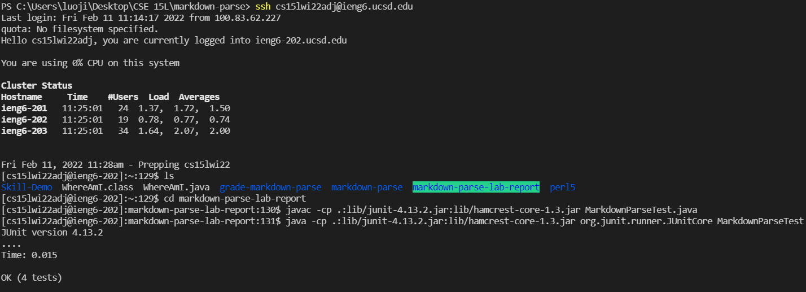

# Lab Report 3
Will Luo, A16989083, 2/11/22
## Copy whole directories with `scp -r`

### *Goals*
1. Show copying your whole markdown-parse directory to your ieng6 account
2. Show logging into your ieng6 account after doing this and compiling and running the tests for your repository
3. Show (like in the last step of the first lab) combining `scp`, `;`, and `ssh` to copy the whole directory and run the tests in one line.

### *Implementation*
1. By using `$ scp -r . cs15lwi22adj@ieng6.ucsd.edu:~/markdown-parse-lab-report` command, I can copy the entire current directory to the server. The `-r` option tells scp to work recursively. The `.` is the source, and is the current directory. The `~/markdown-parse-lab-report` tells scp to create the `markdown-parse-lab-report` directory on the remote server (if it doesn’t exist), and then copy the contents of this directory recursively there.

2. I logged into my account through `ssh`, and then I used the following commands to compile and run `MarkdownParseTest.java`

3. Combining command: `$ scp -r . cs15lwi22adj@ieng6.ucsd.edu:~/markdown-parse-lab-report4; ssh cs15lwi22adj@ieng6.ucsd.edu "cd markdown-parse-lab-report4; javac -cp .:lib/junit-4.13.2.jar:lib/hamcrest-core-1.3.jar MarkdownParseTest.java; java -cp .:lib/junit-4.13.2.jar:lib/hamcrest-core-1.3.jar org.junit.runner.JUnitCore MarkdownParseTest"`

